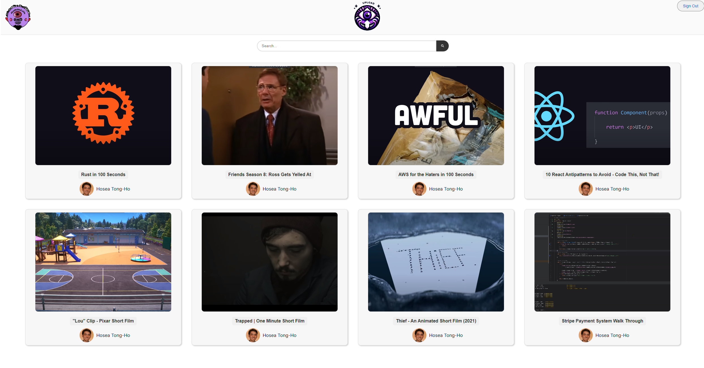

# VideoStreamingPlatform

This is a learning project where I've developed a basic video streaming platform. It's a simple yet functional site, designed to help me understand the fundamentals of web development and streaming technology.

**Features:**
- Basic video streaming capabilities
- Simple user interface

Feel free to check out the project and explore its features: [VideoStreamingPlatform](https://video-streaming-platform-web-client-jg5qmt6o5a-uc.a.run.app)

**Screenshots:**
Here are some screenshots demonstrating the platform's interface:

